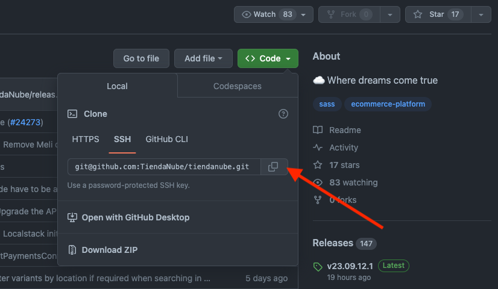
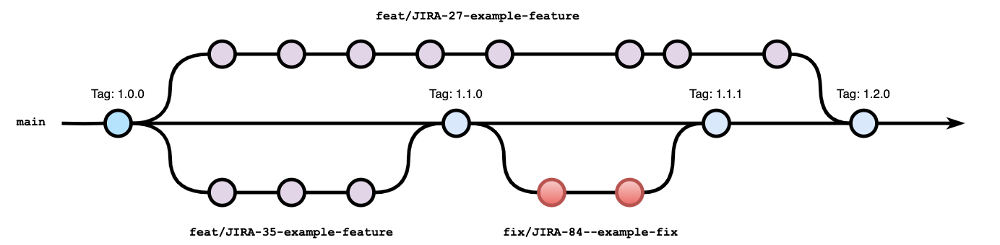
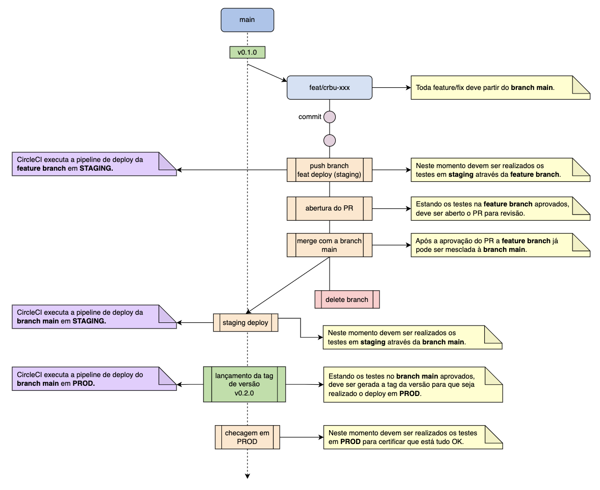
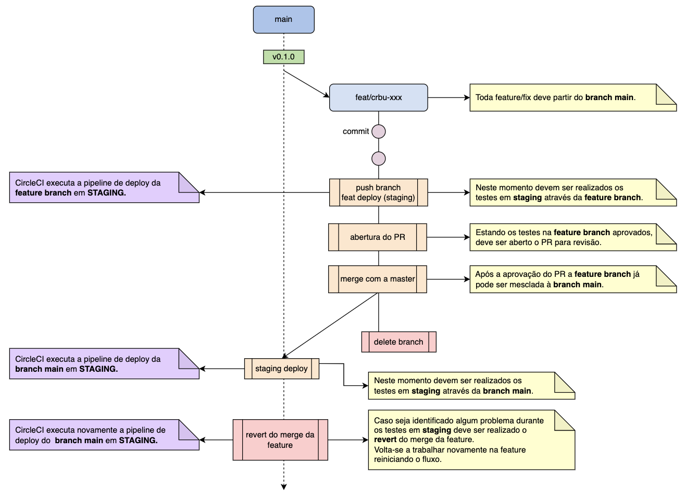
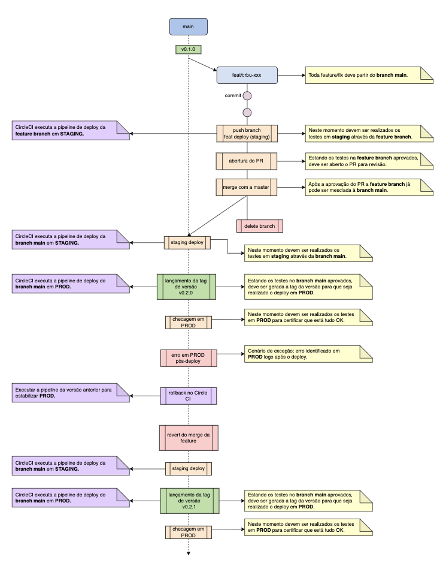
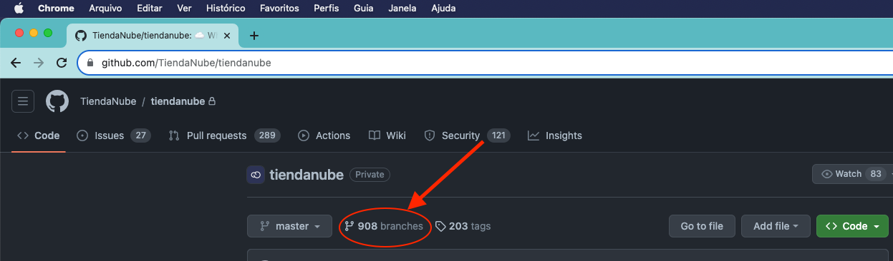
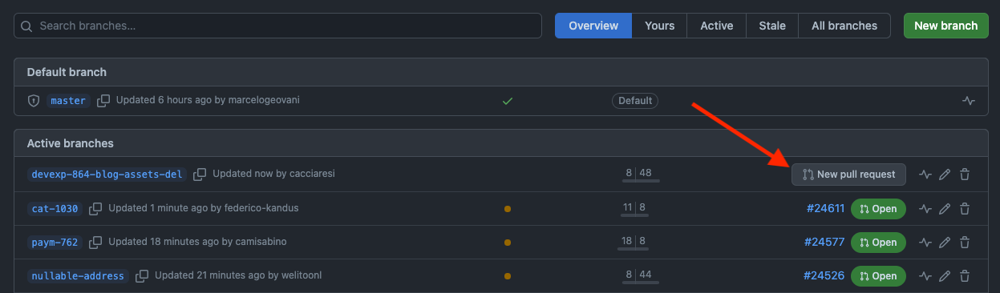
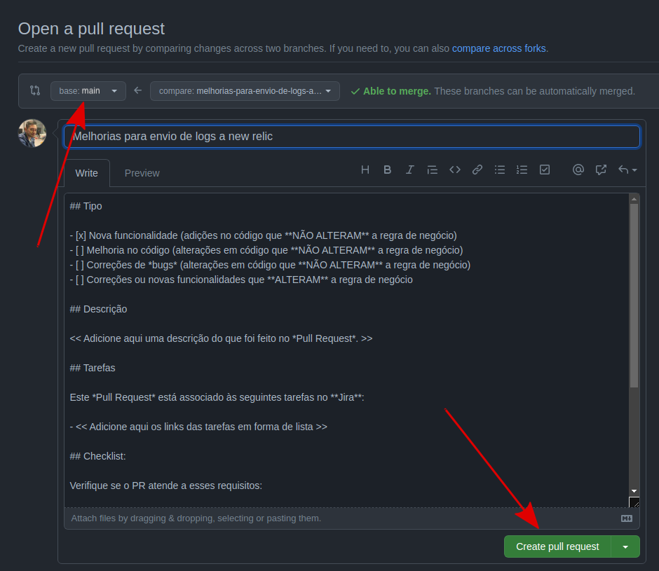

#  Contribution guide and good development practices

**TODO**

#  Guia de contribuição e boas práticas de desenvolvimento

Este documento tem por objetivo registrar as boas práticas de desenvolvimento adotadas
pela [**Squad Cross Business**](https://github.com/orgs/TiendaNube/teams/cross-business) da **Nuvemshop**, tornando
acessível aos colaboradores responsáveis e/ou interessados em contribuir com o código da aplicação,
os requisitos mínimos necessários para que mudanças sejam introduzidas ao código, bem como o fluxo de atividades
recomendadas para a sua evolução, seja na resolução de problemas ou criação de funcionalidades.

## 1. Código de Conduta

Consulte o arquivo [CODE_OF_CONDUCT.md](CODE_OF_CONDUCT.md) para obter detalhes.

## 2. Repositório e controle de versão

Nós utilizamos o [git](https://git-scm.com/) como sistema de controle de versão, portanto, você deve ter o git instalado
em sua máquina local. Você pode verificar se o git está instalado em seu computador e passar pelo processo de instalação
para o seu sistema operacional, seguindo
este [guia](https://www.digitalocean.com/community/tutorials/an-introduction-to-contributing-to-open-source-projects-and-installing-git#check-if-git-is-installed).

Ainda que sejam necessários [poucos comandos](CONTRIBUTION_CHEATSHEET.md) para compartilhar sua contribuição,
recomendamos uma boa compreensão dos [fundamentos](https://git-scm.com/book/en/v2) do git, pois comandos como `stage`,
`diff` e `log` podem ser úteis.

Os repositórios oficiais de todas as aplicações desenvolvidas pela **Squad Cross Business** da **Nuvemshop**
encontram-se disponíveis no [GitHub](https://github.com/orgs/TiendaNube/teams/cross-business/repositories). Para fazer
uma cópia local do repositório e enviar as alterações para o repositório oficial, você precisa de uma conta no GitHub e
se preciso,
solicitar acesso ao repositório através da abertura de um
[chamado](https://tiendanube.atlassian.net/servicedesk/customer/portals) à nossa equipe de suporte.

Para realizar as configurações necessárias, basta seguir as instruções de listadas
no [README.md](README.md#configuração-do-ambiente-de-desenvolvimento).

### 2.1. Clone do repositório

Para criar sua própria cópia local do repositório, primeiro vamos abrir uma janela de terminal.

Vamos utilizar o comando `git clone` juntamente com a URL que aponta para o repositório do projeto.

Você pode, alternativamente, copiar a URL usando o botão verde "Code" da página do repositório. Depois de clicar no
botão, você poderá copiar a URL clicando no botão do fichário ao lado da URL:

<div align="center">
    <br>
    
    <p>Figura 1 - Clone do repositório.</p>
    <br>
</div>

Uma vez que tenhamos a URL, estamos prontos para clonar o repositório. Para fazer isto, vamos combinar o comando `git
clone` com a URL do repositório a partir da linha de comando em uma janela de terminal:

```
$ git clone git@github.com:path/to/repo.git
```

Agora que você tem uma cópia local do código, podemos passar para a criação de uma nova “branch” ou ramificação na qual
iremos trabalhar com o código.

## 3. Política de ramificação

Utilizamos uma política de ramificação própria, baseada no “Trunk Based Development”, que busca unir flexibilidade com
as boas práticas de gestão e lançamento.

Nossa proposta é diminuir a complexidade de promover código, compartilhar código, mitigar os “merges hell” e aumentar
produtividade.

### 3.1. Como funciona

Os desenvolvedores trabalham em uma única ramificação, a “branch main”, a ideia é que tudo que todos estão fazendo,
esteja na “main” e seja compartilhado entre todos os outros desenvolvedores.

Os desenvolvedores abrem ramificaçoes de trabalho (“features” ou “fixes branches”) a partir da “main”; o desenvolvedor
altera o código necessário da tarefa em que está trabalhando no momento, uma vez que essas alterações não quebram o
“build” e os testes passam, o desenvolvedor abre então um “merge request” para a “main”, onde acontece o processo de
“code review”, uma vez completo e o “merge request” é aprovado, então esse código entra na “main” e já pode ser baixado
por todos os outros desenvolvedores.

O “release” desse código é feito direto da ramificação principal, é criada uma “tag” da versão que será liberada e então
o código pode ser promovido para produção.

<div align="center">
    <br>
    
    <p>Figura 2 - Ramificações do fluxo de trabalho.</p>
    <br>
</div>

### 3.2. Ramificação principal (“main”)

A “branch main” irá conter todo código já testado e versionado que será entregue ao cliente. Essa ramificação armazena o
histórico do lançamento oficial.

### 3.3. Ramificação de trabalho (“feature ou fix branch”)

Toda funcionalidade deve ser implementada em uma ramificação própria, ramificada a partir da “branch main”.

#### 3.3.1. Padrão de nomenclatura da ramificação de trabalho

A nova ramificação deverá seguir um padrão de nomenclatura que possibilite a sua identificação e integração com a sua
respectiva tarefa no [Jira](https://tiendanube.atlassian.net/jira/software/c/projects/CRBU/boards/78).

Exemplo:

a) Nova funcionalidade:

**Tarefa no Jira**: CRBU-1984: Desenvolver layout da tela de login

**Nome da branch**: feat/crbu-1984-desenvolver-layout-da-tela-de-login

b) Correção:

**Tarefa no Jira**: CRBU-2023: Corrigir layout da tela de login

**Nome da ramificação**: fix/crbu-2023-corrigir-layout-da-tela-de-login

## 4. Fluxo de desenvolvimento

O fluxo completo de desenvolvimento pode ser resumido em:

1. Gera-se uma ramificação de trabalho a partir da ramificação principal;
2. Realiza-se modificações na ramificação de trabalho e essas modificações são levadas ao repositório remoto;
3. Quando concluída a funcionalidade/correção, aciona-se o CircleCI para executar a “pipeline” de “deploy” da
   ramificação de trabalho em “STAGING”;
4. Na sequência, deve-se realizar os testes em “STAGING” através da ramificação de trabalho;
5. Estando os testes na ramificação de trabalho aprovados, deve-se abrir uma solicitação para revisão de código (PR);
6. Após a aprovação da solicitação de revisão a ramificação de trabalho já pode ser mesclada à ramificação principal e
   então apagada;
7. Aciona-se novamente o CircleCI, mas dessa vez para executar a “pipeline” de “deploy” da ramificação principal em
   “STAGING”;
8. Nesse momento, deve-se realizar os testes em “STAGING” através da ramificação de principal;
9. Estando os testes na ramificação principal aprovados, deve-se ser gerada a “tag” da versão;
10. Finalmente aciona-se o CircleCI para executar a “pipeline” de “deploy” da ramificação de principal em “PRODUCTION”;
11. Em seguida deve-se realizar testes em “PRODUCTION” para certificar que está tudo funcionando corretamente e
    finalizar o processo.

### 4.1. Esquema do fluxo de trabalho

O diagrama a seguir apresenta o fluxo de uma nova funcionalidade, desde a criação da ramificação no git até a publicação
em produção; mostrando as etapas no Git e no CircleCI.

<div align="center">
    <br>
    
    <p>Figura 3 - Fluxo de trabalho.</p>
    <br>
</div>

### 4.2. Esquema do fluxo de trabalho com erro em ambiente de homologação

Esquema do fluxo de trabalho com erro detectado durante o teste em ambiente de homologação.

<div align="center">
    <br>
    
    <p>Figura 4 - Fluxo de trabalho com erro detectado durante o teste em ambiente de homologação.</p>
    <br>
</div>

### 4.3. Esquema do fluxo de trabalho com erro em ambiente de produção

Esquema do fluxo de trabalho com erro detectado durante o teste em produção.

<div align="center">
    <br>
    
    <p>Figura 5 - Fluxo de trabalho com erro detectado durante o teste em ambiente de produção.</p>
    <br>
</div>

### 4.4. Criação da ramificação de trabalho

```
$ cd <caminho-para-a-pasta-do-repositório>

$ git checkout main
$ git reset --hard origin/main
$ git fetch origin --prune
$ git merge

$ git checkout -b <nome-da-ramificação-de-trabalho>
```

### 4.5. Realização de alterações na ramificação de trabalho

Depois de modificar os arquivos existentes ou adicionar novos arquivos ao projeto, você pode adicioná-los ao seu
repositório local, o que podemos fazer com o comando `git add`. Vamos adicionar a _flag_ `-A` para adicionar todas as
alterações que fizemos:

```
$ git add -A
```

Em seguida, queremos registrar as alterações que fizemos no repositório com o comando `git commit`.

A mensagem de “commit” é um aspecto importante da sua contribuição de código; ela ajuda os outros contribuidores a
entenderem completamente a mudança que você fez, porque você fez e o quanto é importante. Adicionalmente, as mensagens
de “commit” fornecem um registro histórico das mudanças para o projeto em geral, ajudando os futuros contribuidores ao
longo do caminho.

Se tivermos uma mensagem muito curta, podemos gravar isso com a “flag” `-m` e a mensagem entre aspas:

```
$ git commit -m "descrição da alteração"
```

Mas, a menos que seja uma mudança muito pequena, é bem provável que incluiremos uma mensagem de confirmação mais longa
para que nossos colaboradores estejam totalmente atualizados com nossa contribuição. Para gravar esta mensagem maior,
vamos executar o comando `git commit` que abrirá o editor de texto padrão:

```
$ git commit
```

Se você gostaria de configurar seu editor de texto padrão, você pode fazê-lo com o comando `git config` e definir
o [nano](https://www.nano-editor.org/) como editor padrão, por exemplo:

```
$ git config --global core.editor "nano"
```

Ou o [vim](https://www.vim.org/):

```
$ git config --global core.editor "vim"
```

Depois de executar o comando `git commit`, dependendo do editor de texto padrão que você está usando, sua janela de
terminal deve exibir um documento pronto para edição que será semelhante a este:

```
# Please enter the commit message for your changes. Lines starting
# with '#' will be ignored, and an empty message aborts the commit.
# On branch nome-da-ramificação-de-trabalho
# Your branch is up-to-date with 'origin/nome-da-ramificação-de-trabalho'.
#
# Changes to be committed:
#       modified:   wip.php
#
```

Abaixo dos comentários introdutórios, você deve adicionar a mensagem de “commit” ao arquivo de texto.

Para seguir a padronização adotada pela _squad_ ao escrever uma mensagem de “commit” você deve consultar
os [padrões de commit](COMMIT_STANDARD.md).

Basicamente para escrever uma mensagem útil no “commit”, você deve incluir um sumário na primeira linha com cerca de 50
caracteres. Abaixo disso, e dividido em seções de fácil entendimento, você deve incluir uma descrição que indique o
motivo pelo qual você fez essa alteração, como o código funciona, e informações adicionais que irão contextualizar e
esclarecer o código para que outras pessoas revisem o trabalho ao mesclá-lo. Tente ser o mais útil e proativo possível
para garantir que os responsáveis pela manutenção do projeto possam entender totalmente sua contribuição.

Depois de salvar e sair do arquivo de texto da mensagem de “commit”, você poderá verificar o “commit” que o git estará
fazendo com o seguinte comando:

```
$ git status
```

Dependendo das alterações que você fez, você receberá uma saída parecida com esta:

```
On branch nome-da-ramificação-de-trabalho
Your branch is ahead of 'origin/nome-da-ramificação-de-trabalho' by 1 commit.
  (use "git push" to publish your local commits)
  nothing to commit, working directory clean
```

Nesse ponto você pode usar o comando `git push` para enviar suas alterações para a ramificação atual no repositório
remoto:

```
$ git push --set-upstream origin <nome-da-ramificação-de-trabalho>
```

O comando irá lhe fornecer uma saída para que você saiba do progresso e será semelhante ao seguinte:

```
Counting objects: 3,"done.
Delta compression using up to 4 threads.
Compressing objects: 100% (3/3), done.
Writing objects: 100% (3/3), 336 bytes | 0 bytes/s, done.
Total 3 (delta 0), reused 0 (delta 0)
To https://github.com/madeiramadeirabr/marco-polo.git
    a1f29a6..79c0e80 nome-da-ramificação-de-trabalho -> nome-da-ramificação-de-trabalho
Branch nome-da-ramificação-de-trabalho set up to track remote branch nome-da-ramificação-de-trabalho from origin.
```

Agora você pode navegar até o repositório e alternar para a “branch” que você acabou de fazer “push” para ver as
alterações que você fez diretamente no navegador.

### 4.6. Atualização da ramificação de trabalho

Enquanto você estiver trabalhando em um projeto ao lado de outros colaboradores, é importante que você mantenha seu
repositório local atualizado com o projeto, pois você não deseja fazer um “pull request” de um código que cause
conflitos 🙂. Para manter sua cópia local da base de código atualizada, você precisará sincronizar as alterações.

```
$ cd <caminho-para-a-pasta-do-repositório>

$ git checkout main
$ git reset --hard origin/main
$ git fetch --all
$ git merge

$ git checkout <nome-da-ramificação-de-trabalho>
$ git rebase main
$ git push -f
```

A saída aqui vai variar, mas começará com **Applying: …** se tiverem sido feitas alterações, ou **Current branch
<nome-da-ramificação-de-trabalho> is up to date.**, se nenhuma alteração foi feita desde que você fez o “clone” do
repositório.

```
Outra saída possível poderá ser uma mensagem de erro indicando que foram encontrados conflitos ao tentar mesclar o
conteúdo dos arquivos.

Nesse caso, deve-se:

1. Resolver todos os conflitos manualmente;
2. Marcá-los como resolvidos com `git add <arquivos-com-conflitos>` ou `git rm <arquivos-com-conflitos>`
3. E então acionar o comando `git rebase --continue`.

Pode-se também pular o commit atual executando `git rebase --skip`.

Já para abortar e voltar ao estado anterior ao "git rebase", execute `git rebase --abort`.
```

A sua “branch” de recurso agora está em sincronia com o repositório remoto, e as alterações locais que você fez não
foram perdidas. Basta agora publicar o código atualizado no repositório remoto, para isso utilize o comando:

```
$ git push -f
```

Dependendo do seu fluxo de trabalho e da quantidade de tempo que você gasta para fazer alterações, você pode sincronizar
sua “branch” com o código do repositório remoto quantas vezes isso fizer sentido para você. No entanto, você certamente
deve sincronizar sua “branch” antes de fazer um “pull request” para garantir que não contribuirá com código conflitante.

### 4.7. Criação do pull request

Quando você concluir o trabalho de desenvolvimento no recurso, a próxima etapa é fazer um “pull request” apontando para
o repositório remoto “staging”.

1. No GitHub, navegue até a página principal do repositório.
2. No menu “branches”, clique no botão **“New pull request”**, ao lado direito da “branch” que contém seus “commits”.

<div align="center">
    <br>
    
    <p>Figura 6 - Branches.</p>
    <br>
</div>

<div align="center">
    <br>
    
    <p>Figura 7 - Novo pull request.</p>
    <br>
</div>

3. Na próxima tela use o menu suspenso do “branch” base (à esquerda) para selecionar o “branch main”, ramificação na
   qual você fará “merge” de suas alterações. Em seguida, se necessário, use o menu suspenso do “branch” de comparação (
   à esquerda) para escolher o “branch” no qual você fez as alterações. Você deverá ver uma tela semelhante a essa:

<div align="center">
    <br>
    
    <p>Figura 68- Criar pull request.</p>
    <br>
</div>

4. O GitHub vai lhe alertar de que é possível mesclar as duas “branches” porque não há código concorrente. Você deve
   adicionar um título, um comentário, indicar ao menos 2 colaboradores da Squad Cross Business como revisores e, em
   seguida, pressionar o botão **“Create pull request”**. Neste ponto, os revisores indicados decidirão se aceitam ou
   não o seu “pull request”. Eles podem solicitar que você edite ou revise seu código antes de aceitar o “pull request”.

#### 4.7.1. Padronização do pull request

O “pull request” deverá seguir um padrão que possibilite a sua identificação e integração com a sua respectiva tarefa no
[Jira](https://tiendanube.atlassian.net/jira/software/c/projects/CRBU/boards/78). O título do “pull request” deverá:

- Conter referência ao número da tarefa
  no [Jira](https://tiendanube.atlassian.net/jira/software/c/projects/CRBU/boards/78) que o originou;
- Conter a descrição sucinta da alteração.

Exemplo:

**Tarefa no Jira**: CRBU-1984: Desenvolver layout da tela de login
**Título do pull request**: [CRBU-1984]: Desenvolvido layout da tela de login

Já para o comentário do “pull request”, fornecemos um “template” gerado automaticamente, onde você deverá:

- Indicar o tipo, marcando um `x` na opção correspondente;
- Adicionar uma descrição do que foi feito no *pull request* e
- Adicionar os “links” das tarefas do [Jira](https://tiendanube.atlassian.net/jira/software/c/projects/CRBU/boards/78)
  em forma de lista.

### 4.8. Ramificação de lançamento (“release”)

Ao final do ciclo de desenvolvimento, após os testes terem sido devidamente homologados, uma “release” é lançada a
partir da ramificação da “branch main”.

## 5. Cheatsheet

Consulte a seção [guia de contribuição](CONTRIBUTION_CHEATSHEET.md) para um guia rápido de contribuição.

## 6. Padrão de commit

Consulte a seção [padrões de commit](COMMIT_STANDARD.md) para obter detalhes.

## 7. Versionamento

O padrão de versionamento utilizado pela equipe é uma adaptação do [**semantic versioning
**](https://semver.org/lang/pt-BR/) e também consiste em três números inteiros, positivos e sequenciais separados por
pontos (e.x., 2.3.23).

### Major (primeiro número)

Quando fizermos mudanças onde a compatibilidade com versões anteriores não é garantida teremos uma “major release”.

Sempre que a major é incrementada, o “patch” e “minor” devem ser redefinidos para `0`.

### Minor (segundo número)

Deve ser incrementado quando introduzir, remover ou adicionar uma funcionalidade à aplicação.

Estas alterações devem ser compatíveis com versões anteriores da mesma linha “major” (mas não necessariamente com
versões subsequentes).

Sempre que a “minor” é incrementada, o “patch” deve ser redefinido para `0`.

### Patch (terceiro número)

Deve ser incrementado quando correções de “bugs” ou melhorias na segurança forem introduzidas.

Estas alterações devem ser totalmente compatíveis com versões anteriores da mesma linha “minor”.

## 8. Ciclo de vida de evolução do código

O fluxo abaixo representa o ciclo de vida de evolução do código e as etapas necessárias para que mudanças sejam
incorporadas, sejam elas correções de “bugs” ou novas funcionalidades.

<div align="center">
    <pre>Backlog do produto -> Refinement</pre>
    <pre>Planning e backlog da sprint -> Sprint -> Revisão da sprint -> Retrospectiva da sprint</pre>
    <pre>Reunião diária</pre>
</div>

### 8.1. Backlog do produto

O “product owner” irá definir as metas e objetivos gerais e, muitas vezes, um roteiro do produto. O “backlog” do produto
deve representar esse roteiro, contemplando uma lista de recursos, requisitos e correções de “bugs” (para
“software” ativo) que contém breves descrições de todas as funcionalidades desejadas para um produto específico
ainda não atribuídas a um responsável e priorizados de acordo com o valor entregue para o cliente. À medida que os
requisitos são descobertos, o “backlog” pode e deve ser ampliado. O importante é que contenha informações suficientes
para que o time consiga realizar estimativas de desenvolvimento.

### 8.2. Refinement

É onde quaisquer requisitos grandes (geralmente chamados de “épicos”) serão divididos em tarefas tangíveis (geralmente
definidos a partir da perspectiva do usuário e chamados de histórias de usuário), com estimativas de quanto esforço cada
uma levará. Ou seja, depois de entrar em acordo sobre um plano geral de implementação, o problema é convertido em
tarefas, que no futuro serão feitas pela equipe de desenvolvimento. Dessa forma, e seguindo o processo de trabalho, fica
mais fácil priorizar o que deve ser feito em cada “sprint”.

Uma vez que os recursos necessários à implementação da mudança estão adequados ao cronograma da equipe e alinhada com as
diretrizes da empresa, a “issue” devidamente refinada e estimada entra para o “roadmap”.

### 8.3. Planning e backlog da sprint

Etapa onde ocorre a reunião de planejamento da “sprint”.

Nela serão selecionadas as tarefas do _backlog do produto_ que irão compor a lista de atividades da “sprint” (“backlog
da sprint”). Essa lista será definida de forma que seja pequena o suficiente para ser alcançável em seu intervalo de
tempo.

Um ou mais membros da equipe são atribuídos como responsáveis e a solicitação de mudança será devidamente priorizada e
adicionada ao planejamento da “release”.

### 8.4. Sprint

Assim que a reunião de planejamento da “sprint” termina, inicia-se a etapa de execução. Aqui, o time de desenvolvimento
começa a trabalhar segundo os planos de entrega que planejou, atentando-se aos requisitos de produto delineados pelo
“product owner” e ao prazo final da “sprint”.

“Sprint”, no “framework scrum”, é um período de tempo limitado a um mês ou menos, no qual uma versão incremental e
usável de um produto é desenvolvida.

Esse conceito vem do termo “sprint”, em inglês, que se refere a um tipo de corrida de velocidade em que o atleta
percorre uma distância curta num período de tempo mais curto ainda. Sendo assim, a ideia da “sprint” no “scrum” é que
deve-se cumprir uma meta dentro de um período determinado, e que ao final o produto seja “pronto”.

A duração da “sprint” é “time-boxed”, isto é, limitada a um tempo, e pode variar de uma a quatro semanas, dependendo da
produtividade do time para entregar uma funcionalidade completa do produto. Porém, uma vez decidida a duração da
“sprint”, ela deve ser mantida até o final do projeto.

#### 8.4.1. Etapas do desenvolvimento de uma funcionalidade na “sprint”:

- **“TAREFAS PENDENTES”**: solicitações aceitas pela equipe, aptas para desenvolvimento;
- **“EM ANDAMENTO”**: a solicitação está sendo desenvolvida, mas ainda não está completa;
- **“CODE REVIEW”**: solicitação de revisão de código por pares;
- **“TESTES”**: a implementação da solicitação está sendo testada;
- **“BLOCK”**: a tarefa possui algum impedimento;
- **“READY FOR DEPLOY”**: a solicitação encontra-se na fila de espera para implementação em produção;
- **“CANCEL”**: a tarefa foi cancelada.
- **“CONCLUÍDO”**: a implementação da solicitação está completa.

##### 8.4.1.1. Desenvolvimento (EM ANDAMENTO)

Os desenvolvedores atribuídos a “issue” realizam as devidas alterações no código e os respectivos testes, respeitando as
[convenções](CODING_STANDARDS.md).

Assim que o código estiver adequado para revisão e apto para o “merge” (sem conflitos), um “pull request” deve ser
aberto e as “labels” adequadas adicionadas ao PR.

Todo “pull request” enviado ao repositório passa pelo processo de integração, sendo necessário que a _build_ passe em
todos os testes para que o “pull request” siga para revisão.

##### 8.4.1.2. Revisão por pares (CODE REVIEW)

A um ou mais membros da equipe é atribuído a revisão do código (_reviewer's_) e deve(m):

- Manter uma comunicação clara, dando o máximo de detalhes nos seus comentários;
- Pontuar aspectos positivos e negativos sobre o código;
- Ter uma boa compreensão da modificação proposta (corrige um “bug”, melhora uma funcionalidade ou parte do código);
- Utilizar o botão de _review changes_ do GitHub para comentar, aprovar ou solicitar alterações nos “commits”;
- Levar em conta que uma boa solução para um problema hoje é geralmente melhor do que uma solução perfeita amanhã;
  Entretanto, uma gambiarra hoje é geralmente pior do que uma boa solução amanhã. Na dúvida, solicite a opinião de
  outras pessoas.

A revisão deve avaliar aspectos como:

- A mudança se enquadra no propósito declarado pela história/tarefa;
- É válida dentro da arquitetura existente do projeto;
- Introduz possíveis defeitos que causarão problemas futuros;
- Segue as [convenções](CODING_STANDARDS.md);
- É uma boa maneira de executar a função descrita;
- Introduz qualquer risco de segurança ou instabilidade;
- e demais aspectos que julgar necessário.

Uma vez que a modificação proposta pelo “pull request” seja aprovada, o “deployer” deve realizar o “merge” da “feature”
na ramificação “main” tornando-a disponível para homologação.

##### 8.4.1.3. Homologação (TESTES)

Nesse momento o desenvolvedor responsável pela implementação deve avaliar a modificação testando o uso da funcionalidade
e avaliando os critérios funcionais, não funcionais e de performance, para em seguida avançar (segue para “READY FOR
DEPLOY”) ou corrigir (retorna para “EM ANDAMENTO”) a tarefa.

##### 8.4.1.4. Deploy em produção (CONCLUÍDO)

Será gerado a “tag” de versão e realizado o “deploy” no ambiente de produção, fechando a solicitação.

### 8.5. Revisão da “sprint”

Quando a “sprint” chega ao final, é necessário realizar a revisão da “sprint” (ou _sprint review_) para inspecionar o
resultado e adaptar o “backlog” do produto, se for o caso. Todo o time “scrum” participa do evento, que tem _time-box_
máximo de 4 horas.

Os principais pontos de discussão da revisão envolvem o esclarecimento sobre os itens que foram “prontos” e os que não
foram, a reflexão sobre o que foi bem e os problemas que foram encontrados, e as sugestões do time “scrum” para o que
deve ser feito a seguir, levando em consideração as mudanças do mercado, a linha do tempo, o orçamento e as prioridades.

Como resultado dessa reunião é produzida uma nova versão do “backlog” do produto, que poderá ser utilizada na próxima
“sprint”.

### 8.6. Retrospectiva da “sprint”

Enquanto a revisão da “sprint” busca avaliar o produto do trabalho do time de desenvolvimento, a retrospectiva da
“sprint” (“sprint retrospective”) é uma oportunidade para que a equipe avalie a si mesma, refletindo sobre suas práticas
e desenhando melhorias para aplicar na próxima “sprint”.

Participam dessa reunião o time de desenvolvimento e o “scrum master”, que tem a responsabilidade de ensinar a equipe a
seguir o processo “scrum” e a ficar dentro do “time-box” de, no máximo, três horas.

Ele encoraja a equipe a melhorar o processo de desenvolvimento de acordo com o “framework” do “scrum”, ajudando-a a
planejar formas de aumentar a qualidade do produto e a adaptar a definição de “pronto”.

Desse modo, no final da retrospectiva da “sprint”, o produto será a relação das melhorias a serem implementadas no
próximo ciclo. O final desta reunião marca o final oficial da “sprint”.

### Reunião diária

Ao longo da execução da “sprint”, o time de desenvolvimento se reúne diariamente para avaliar como está o andamento das
atividades e definir o que será feito no dia para alcançar a meta da “sprint”. São as chamadas reuniões diárias (ou
“daily sprints”).

O “time-box” dessas reuniões é de 15 minutos, e elas são comumente realizadas no mesmo horário.

Há três perguntas que devem ser respondidas na reunião diária:

- O que eu fiz ontem que ajudou o time de desenvolvimento a alcançar a meta da “sprint”?
- O que eu farei hoje para ajudar o time de desenvolvimento a alcançar a meta da “sprint”?
- Existe algum obstáculo que impeça o time de desenvolvimento de alcançar a meta da “sprint”?

<div align="center">
    <br>
    
    <br>
    <p>Figura 8 - Resumo de como a sprint funciona.</p>
    <br>
</div>

## Reportando um problema

A gestão dos “bugs” é feita pelo [servide desk](https://tiendanube.atlassian.net/servicedesk/customer/portals) e um
chamado pode ser aberto por qualquer colaborador.

A aberura de um chamado é a maneira adequada de compartilhar e discutir as tarefas, aprimoramentos e bugs com o resto da
equipe. Entretanto, recomendamos algumas orientações e que algumas informações sejam registradas para que o “bug” seja
prontamente rastreado e validado.

Antes de enviar um problema, pesquise no rastreador de problemas, talvez já exista um problema para o seu problema e a
discussão possa informá-lo sobre as soluções disponíveis.

Queremos corrigir todos os problemas o mais rápido possível, mas antes de corrigir um “bug”, precisamos reproduzi-lo e
confirmá-lo. Para reproduzir “bugs”, solicitaremos sistematicamente que você forneça uma reprodução mínima. Ter um
cenário reprodutível mínimo nos dá uma riqueza de informações importantes sem precisar voltar a você com perguntas
adicionais.

Uma reprodução mínima nos permite confirmar rapidamente um “bug” (ou apontar um problema de codificação) e também
confirmar que estamos corrigindo o problema correto.

Vamos insistir em um cenário mínimo de reprodução para economizar tempo dos mantenedores e, finalmente, poder corrigir
mais “bugs”.

Infelizmente, não podemos investigar / corrigir erros sem uma reprodução mínima; portanto, se não recebermos uma
resposta sua, fecharemos um problema que não possui informações suficientes para serem reproduzidas.

Enfim, recomendamos que as seguintes informações sejam registradas na abertura de um chamado:

* **Título**: é uma pequena sentença que de forma sucinta descreve o que é o “bug”;
* **Descrição**: que é uma descrição completa do “bug”;
* **Etapas**: etapas necessárias para reproduzir o comportamento que gerou o “bug”;
* **Resultado**: comportamento equivocado da aplicação, que ocasionou no “bug”;
* **Resultado esperado**: comportamento esperado da aplicação, caso o “bug” não houvesse ocorrido;
* **Versão**: que se refere à versão da aplicação na qual o “bug” foi encontrado;
* **Browser**: navegador e versão do browser usado para acessar a plataforma;
* **OS**: que se refere ao sistema operacional em que se manifestou o problema,
* **Anexo**: no qual podemos adicionar documentos, imagens capturadas, ou qualquer outra informação que ajude na
  identificação e resolução do “bug”.

Uma vez cadastrado o chamado, um membro da equipe deve confirmar a pertinência da solicitação e atribuir a devida
“label”:

* **Backport**: Para problemas em versões antigas cuja solução já foi implementada em versões posteriores;
* **Bug**: Para problemas confirmados com funcionalidades existentes;
* **Feature**: Solicitações de novas funcionalidades;
* **Improvement**: Solicitações de melhoria em funcionalidades já existentes;
* **Design**: Solicitações referente a interface gráfica e componentes do _front-end_;

Prioridade:

* **Prioridade Baixa**: Solicitações aceitas pela equipe, mas sem urgência de resolução.
* **Prioridade Média**: Solicitações aceitas pela equipe, aptas para desenvolvimento.
* **Prioridade Alta**: Solicitações aceitas pela equipe, cuja resolução é imprescindível.
* **Crítico**: Causa perda ou corrupção de dados, congela a aplicação após uma operação específica ou permite que
  usuários não autenticados vejam conteúdo protegido;

## Muito Obrigado!

Caso ache algo difícil de descobrir, avise-nos para que possamos melhorar nosso processo ou documentação!

## Créditos

Valendo-se da máxima de [Lavoisier<sup>1</sup>](https://pt.wikipedia.org/wiki/Antoine_Lavoisier) e do espírito de
compartilhamento de conhecimento, esse guia foi inspirado em boas práticas adotadas por comunidades notáveis:

- [gitlab](https://gitlab.com/),
- [discourse](http://www.discourse.org/),
- [jquery](https://jquery.com/),
- [jekyllrb](https://jekyllrb.com/),
- [bootstrap](http://getbootstrap.com/),
- [gnome](https://www.gnome.org/),
- [mozila](https://www.mozilla.org/en-US/),
- [openstack](https://wiki.openstack.org/wiki/Main_Page),
- [angula.js](https://docs.angularjs.org/guide),
- [liferay](https://www.liferay.com/))
- e muito *googleing*.

## Notas

<sub>1. No século XVIII, o proeminente francês enunciou a máxima: **“Na natureza nada se cria, nada perde, tudo se
transforma”** – é conhecida como a lei de Lavoisier de conservação das massas. Conhecido como o pai da química moderna,
fez também contribuições importantes na biologia e ajudou a criar o sistema métrico.</sub>

#  Guía de contribución y buenas prácticas de desarrollo

**TODO**
